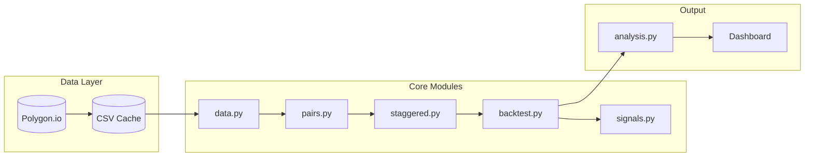
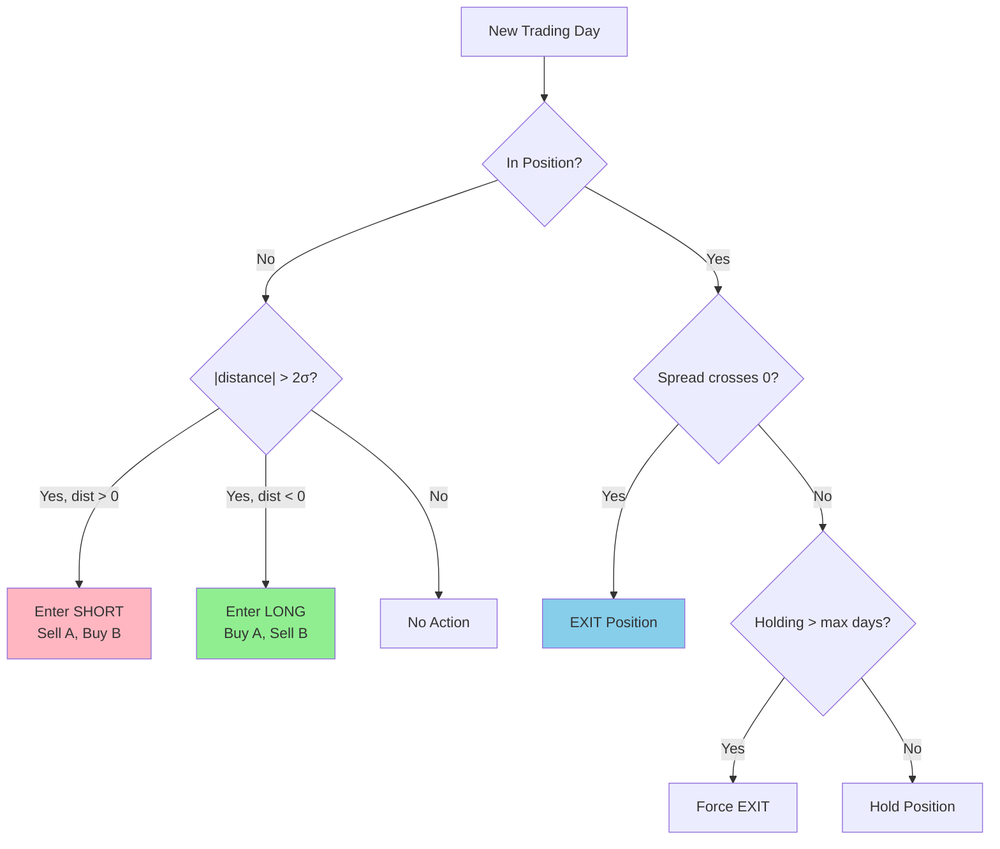
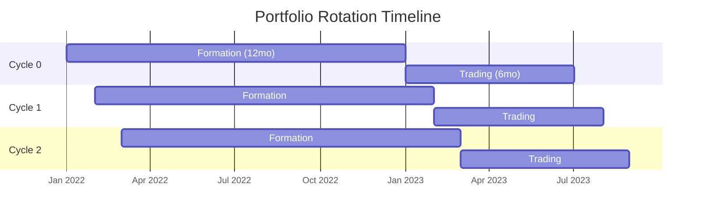
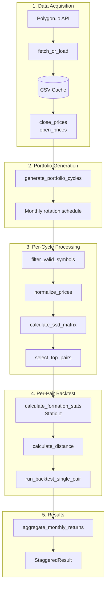

# GGR Distance Method - Pair Trading Backtester

A Python implementation of the **Gatev, Goetzmann, and Rouwenhorst (GGR) Distance Method** for statistical pair trading, featuring the full staggered portfolio methodology and an interactive dashboard.

## Features

- **Staggered Portfolio Methodology**: Overlapping portfolios with 12-month formation and 6-month trading periods (~6 active portfolios at steady state)
- **Static Formation Statistics**: Standard deviation calculated once during formation (not rolling)
- **Proper Execution Timing**: Signals at close, execution at next-day open (no lookahead bias)
- **Interactive Dashboard**: Visualize performance, analyze pairs, and inspect trades with correct per-cycle calculations
- **Dollar-Based Metrics**: Realized P&L tracking with fair capital allocation per GGR paper
- **Sector-Based Configuration**: CLI flags for utilities, tech, shipping, or S&P 500 universes
- **Delisting Handling**: Graceful position closure when stocks delist mid-trade
- **Performance Optimized**: Vectorized NumPy operations, SSD caching, and optional parallelization for 500+ stock universes
- **Comprehensive Test Suite**: 183 tests covering methodology edge cases

## Architecture Overview



## Table of Contents
- [Architecture Overview](#architecture-overview)
- [The GGR Distance Method](#the-ggr-distance-method)
- [Quick Start](#quick-start)
- [Dashboard](#dashboard)
- [Project Structure](#project-structure)
- [Configuration](#configuration)
- [How It Works](#how-it-works)
- [Testing](#testing)

---

## The GGR Distance Method

The GGR Distance Method is a foundational statistical arbitrage strategy first published by Gatev, Goetzmann, and Rouwenhorst in their 2006 paper *"Pairs Trading: Performance of a Relative-Value Arbitrage Rule"* (Review of Financial Studies).

### Core Concept

The strategy exploits **mean reversion** in the price relationship between similar stocks. When two historically correlated stocks diverge in price, the strategy bets they will converge back to their historical relationship.

### The Two-Phase Approach

#### Phase 1: Formation Period (Pair Selection)

During the formation period, we identify pairs of stocks that have moved together historically:

1. **Normalize Prices**: Convert all price series to start at 1.0
   ```
   P_normalized(t) = P(t) / P(0)
   ```

2. **Calculate Sum of Squared Differences (SSD)**: For each pair of stocks, measure how closely their normalized prices track each other
   ```
   SSD(A, B) = Σ (P_A_norm(t) - P_B_norm(t))²
   ```

3. **Select Top Pairs**: Choose pairs with the lowest SSD (most similar historical behavior)

**Why SSD?** Unlike correlation, SSD captures both the direction AND magnitude of price movements. Two stocks can be highly correlated but trade at very different levels - SSD penalizes this divergence.

#### Phase 2: Trading Period (Signal Generation & Execution)

For each selected pair, we monitor the spread and trade when it diverges:

1. **Calculate Spread**: The difference between normalized prices
   ```
   Spread(t) = P_A_norm(t) - P_B_norm(t)
   ```

2. **Calculate Distance**: Use the STATIC standard deviation from the formation period
   ```
   Distance(t) = Spread(t) / σ_formation
   ```

   **Important**: GGR uses a **fixed** σ calculated once during the formation period. This σ does not change during trading.

3. **Trading Signals**:
   - **Entry (Long Spread)**: When Distance < -2.0 (spread is unusually low)
     - Buy Stock A, Sell Stock B
     - Bet: A will outperform B as spread reverts to parity

   - **Entry (Short Spread)**: When Distance > 2.0 (spread is unusually high)
     - Sell Stock A, Buy Stock B
     - Bet: B will outperform A as spread reverts to parity

   - **Exit**: When spread **crosses zero** (prices converge/cross)
     - Per GGR paper: Exit occurs when normalized prices intersect

### Signal Logic Flowchart



### Visual Example

```
Price (Normalized)
    │
1.2 │      Stock A ──────╮
    │                     ╲    ← Spread widens (distance > 2σ)
1.0 │─────────────────────────── Entry: Short spread
    │                     ╱
0.8 │      Stock B ──────╯
    │
    └────────────────────────── Time
                         │
                    Spread reverts, exit when prices cross
```

### Why It Works (Theory)

1. **Mean Reversion**: Similar stocks in the same sector are driven by common factors. Short-term divergences are often noise that corrects.

2. **Market Neutrality**: By going long one stock and short another, you're hedged against broad market moves. Profit comes from the *relative* performance.

3. **Statistical Edge**: The 2σ entry threshold means we only trade when divergence is statistically significant (< 5% probability under normal distribution).

### Risks and Limitations

- **Regime Changes**: Pairs can permanently diverge (e.g., one company loses market share)
- **Convergence Timing**: The spread may take longer to converge than your holding period
- **Transaction Costs**: Frequent trading erodes profits
- **Crowding**: Popular pairs may have reduced alpha due to competition

---

## Quick Start

### 1. Setup

```bash
git clone https://github.com/dhrstrijker/ggr-backtest.git
cd ggr-backtest

# Create virtual environment
python3 -m venv venv
source venv/bin/activate  # On Windows: venv\Scripts\activate

# Install dependencies
pip install -r requirements.txt

# Set up your API key
cp .env.example .env
# Edit .env and add your Polygon.io API key
```

### 2. Run the Dashboard

```bash
# Run with default sector (utilities)
python dashboard.py

# Or choose a specific sector
python dashboard.py --utilities     # ~34 utility stocks (default)
python dashboard.py --tech          # ~50 technology stocks
python dashboard.py --shipping      # ~20 shipping stocks
python dashboard.py --us-market     # ~500 S&P 500 stocks

# Custom configuration
python dashboard.py --config path/to/config.json
```

Then open http://localhost:8050 in your browser.

### 3. Run Tests

```bash
pytest tests/ -v
```

---

## Dashboard

The interactive dashboard provides three main views:

### Fund Overview
- **Header Metrics**: Total P&L, Annualized Return, Sharpe Ratio, Max Drawdown, Win Rate, Total Trades
- **Cumulative P&L Chart**: Realized P&L over time (dollars, not misleading percentage returns)
- **Monthly P&L Chart**: Dollar P&L per month with profit/loss coloring
- **Risk Metrics Table**: Sharpe ratio, max drawdown, capital committed, trading period
- **Trade Statistics Table**: Total P&L, trade counts, win rate, profit factor, avg win/loss

### Pairs Summary
- All pairs ranked by total P&L
- Trade counts and win rates per pair
- Click any pair to navigate to the Pair Inspector

### Pair Inspector
- **Normalized Prices Chart**: GGR Figure 1 style visualization with trade markers
- **Spread Distance Chart**: Shows distance in σ units with correct per-cycle calculation
  - Cycle selector to view different portfolio periods
  - Displays formation σ used for that cycle
- **Trade History Table**: All trades for the pair across all cycles

### Why Dollar-Based Metrics?

The dashboard uses **realized P&L** rather than portfolio percentage returns because:
- Percentage returns can be misleading when averaging across portfolios with different capital
- Realized P&L reflects actual money made/lost from closed trades
- Matches the GGR paper's "one-dollar long, one-dollar short" methodology

---

## Project Structure

```
ggr-backtest/
├── README.md
├── requirements.txt
├── .env.example
├── dashboard.py              # Dashboard entry point with sector CLI flags
├── src/
│   ├── __init__.py
│   ├── data.py               # Polygon.io data fetching + CSV caching
│   ├── pairs.py              # SSD matrix calculation + pair selection
│   ├── signals.py            # Formation stats + distance calculation
│   ├── backtest.py           # Single-pair backtest engine
│   ├── staggered.py          # Staggered portfolio methodology
│   └── analysis.py           # Performance metrics + visualization
├── configs/
│   └── sectors/              # All configuration lives here (no hardcoded defaults)
│       ├── utilities.json    # ~34 utility stocks (default)
│       ├── tech.json         # ~50 technology stocks
│       ├── shipping.json     # ~20 shipping stocks
│       └── us_market.json    # ~500 S&P 500 stocks
├── dashboard/
│   ├── app.py                # Dash application factory
│   ├── data_store.py         # Pre-computed backtest results
│   ├── layouts/              # Page layouts (fund overview, pairs, inspector)
│   └── callbacks/            # Interactive callbacks
├── tests/                    # 183 tests covering all methodology details
│   ├── test_backtest.py
│   ├── test_staggered.py
│   ├── test_signals.py
│   └── ...
└── data/                     # Cached price data (gitignored)
```

---

## Configuration

All configuration is centralized in `configs/sectors/` as JSON files. There are no hardcoded defaults in the codebase - the dashboard always loads configuration from these files.

### Sector CLI Flags

| Flag | Sector | Symbols | Description |
|------|--------|---------|-------------|
| `--utilities` | Utilities | ~34 | US utility companies (default) |
| `--tech` | Technology | ~50 | Large/mid-cap tech stocks |
| `--shipping` | Shipping | ~20 | Container, dry bulk, tanker companies |
| `--us-market` | S&P 500 | ~500 | Broad US market coverage |
| `--config FILE` | Custom | Variable | Load from JSON config file |

### Sector Config File Format

Sector configurations are stored in `configs/sectors/` as JSON files:

```json
{
  "name": "Utilities",
  "description": "US Utilities sector stocks",
  "symbols": ["NEE", "DUK", "SO", "AEP", "..."],
  "start_date": "2015-01-01",
  "end_date": "2026-01-01",
  "formation_days": 252,
  "trading_days": 126,
  "overlap_days": 21,
  "n_pairs": 10,
  "entry_threshold": 2.0,
  "max_holding_days": 126,
  "capital_per_trade": 10000.0,
  "commission": 0.001
}
```

**Note:** Formation period filtering requires 100% data coverage (no `min_data_pct` threshold). Symbols must have traded every day during the 12-month formation period per GGR methodology.

### Staggered Portfolio Parameters

| Parameter | Default | Description |
|-----------|---------|-------------|
| `formation_days` | 252 | Formation period (~12 months) for SSD calculation and σ |
| `trading_days` | 126 | Trading period (~6 months) per portfolio |
| `overlap_days` | 21 | Days between portfolio starts (~1 month) |
| `n_pairs` | 10 | Number of top pairs selected per cycle |

### Execution Modes

| `wait_days` | Execution | Description |
|-------------|-----------|-------------|
| 1 (default) | Next-day OPEN | Signal at close, execute at next open (reduces bid-ask bounce) |
| 0 | Same-day CLOSE | Execute immediately at signal close |

**Note**: Per GGR methodology, exits occur when the spread crosses zero (prices converge).

---

## How It Works

### Staggered Portfolio Methodology

The implementation follows the GGR paper's staggered approach:



At steady state: **~6 portfolios active simultaneously**
Monthly return = arithmetic average across active portfolios

### Data Flow



### Key Implementation Details

1. **No Lookahead Bias**: Trades execute at the OPEN of the day AFTER the signal is generated. The signal uses the closing price, but execution happens at next-day open.

2. **Static σ (GGR Methodology)**: The GGR method calculates standard deviation **once** during the formation period. This σ remains fixed throughout the trading period.

3. **Crossing Zero Exit**: Per the original GGR paper, positions are closed when normalized prices **cross** (spread = 0), indicating full mean reversion.

4. **Per-Cycle Normalization**: Prices are normalized from the START of each trading period, not from the beginning of all data. This is critical for correct distance calculation.

5. **Arithmetic Averaging**: Monthly returns are the simple arithmetic mean across active portfolios, per GGR methodology.

6. **Commission Model**: Flat percentage commission (0.1%) applied on entry and exit.

7. **Formation-Only Filtering**: Symbols must have 100% data coverage during the formation period. No filtering based on trading period data (that would be look-ahead bias).

8. **Delisting Handling**: If a stock delists during trading (NaN prices), the position is closed at the last available price with `exit_reason='delisting'`.

---

## Performance Optimizations

The backtester is optimized for large stock universes (500+ symbols):

| Optimization | Description | Impact |
|--------------|-------------|--------|
| **Vectorized SSD** | NumPy broadcasting for pair distance calculation | 10-100x faster |
| **SSD Caching** | Cache formation period computations across overlapping cycles | 2-3x faster |
| **Parallel Backtests** | Optional joblib parallelization for pair backtests | 2-4x faster |
| **Shared Formations** | Dashboard computes SSD matrices once for both wait modes | ~50% faster |
| **NumPy Arrays** | Pre-extracted arrays in backtest loop | 20-30% faster |

**Estimated performance for US Market (500 stocks):** 2-5 minutes (vs 30-60 min unoptimized)

To enable parallel backtests:
```python
from src.staggered import run_staggered_backtest

result = run_staggered_backtest(
    close_prices, open_prices, config,
    parallel=True,  # Enable parallel pair backtests
    n_jobs=-1,      # Use all CPU cores
)
```

---

## Testing

The test suite (183 tests) validates critical methodology assumptions:

### Backtest Tests (`test_backtest.py`)
- Trade execution at next-day open (wait_days=1) or same-day close (wait_days=0)
- P&L calculation correctness
- Max holding days enforcement
- Exit reason tracking ("crossing", "max_holding", "end_of_data", "delisting")
- Initial divergence handling (trades can open on day 1)
- Maximum adverse excursion (MAE) tracking
- Forced liquidation at period end
- Delisting handling with NaN price safety

### Staggered Tests (`test_staggered.py`)
- Cycle generation with correct window alignment
- Steady state achieves ~6 active portfolios
- Arithmetic averaging of returns (not geometric)
- Per-cycle pair selection
- Monthly return aggregation
- Zero interest assumption (uninvested capital earns 0%)
- Formation-only filtering (100% coverage, no look-ahead bias)

### Signal Tests (`test_signals.py`)
- Entry triggers when |distance| > 2σ (static from formation)
- Crossing-zero exit for full mean reversion
- Formation statistics calculated correctly
- Distance calculation uses fixed σ

### Analysis Tests (`test_analysis.py`)
- Dollar-based GGR metrics calculation
- Monthly and cumulative P&L series
- Sharpe ratio from realized P&L
- Capital allocation (fully invested vs committed)

### Data Integrity Tests (`test_data_integrity.py`)
- Gap detection in trading data
- NaN value detection
- Price validation

Run all tests:
```bash
pytest tests/ -v

# With coverage
pytest tests/ -v --cov=src
```

---

## GGR Method Key Characteristics

| Aspect | GGR Implementation |
|--------|-------------------|
| σ calculation | Static (formation period only) |
| Exit condition | Spread crosses zero |
| Execution | Next-day open |
| Normalization | Per-trading-period start |
| Portfolio | Staggered overlapping (~6 active) |
| P&L Tracking | Realized (on trade exit) |
| Capital Basis | Committed capital across active portfolios |
| Formation filter | 100% data coverage (no look-ahead) |
| Delisting | Close at last available price |

---

## References

- Gatev, E., Goetzmann, W. N., & Rouwenhorst, K. G. (2006). *Pairs Trading: Performance of a Relative-Value Arbitrage Rule*. Review of Financial Studies, 19(3), 797-827.

---

## License

MIT
